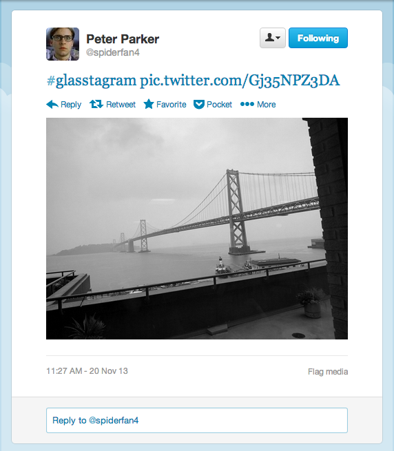

Glasstagram
===========

My GDK hackathon project. Take cool pics like this and share it to Twitter with Google Glass 

Setup
=====
1. Replace the Strings in [SecretKeys.java](App/src/com/fourpool/glasstagram/SecretKeys.java) with your own Twitter Auth Tokens that have Timeline Read/Write access.
2. Install.
3. Take pics, add filters and captions.
